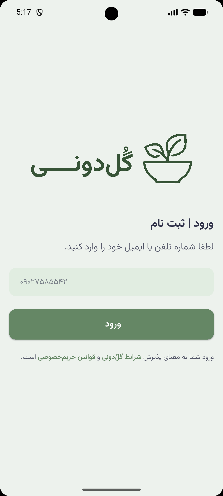
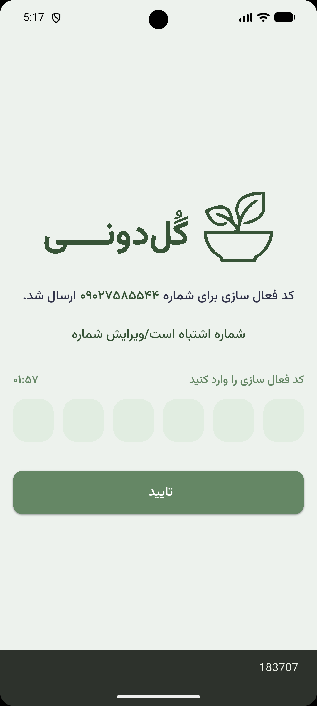
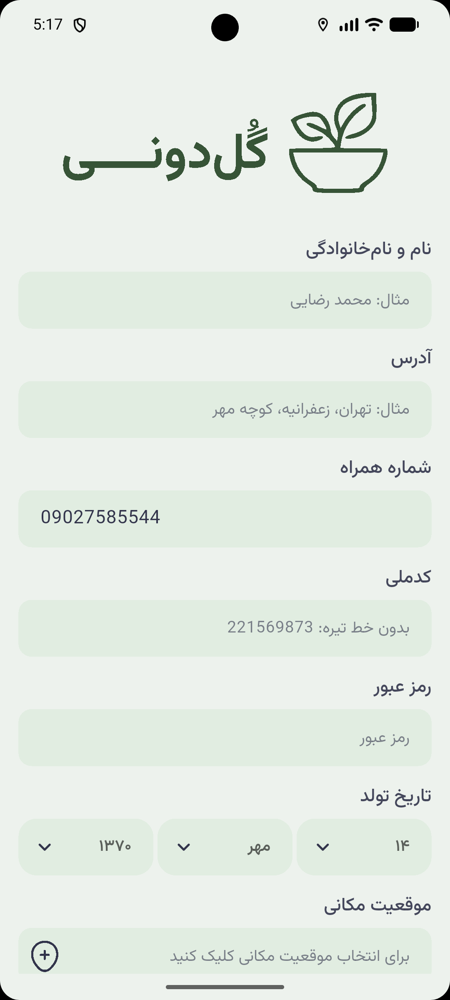
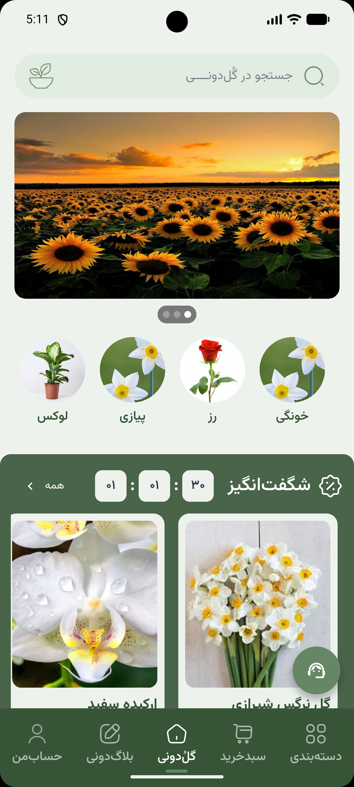
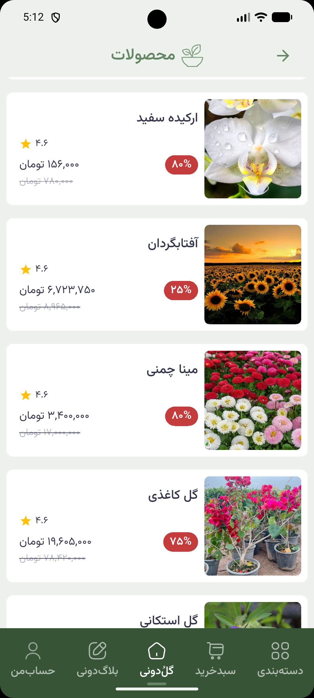
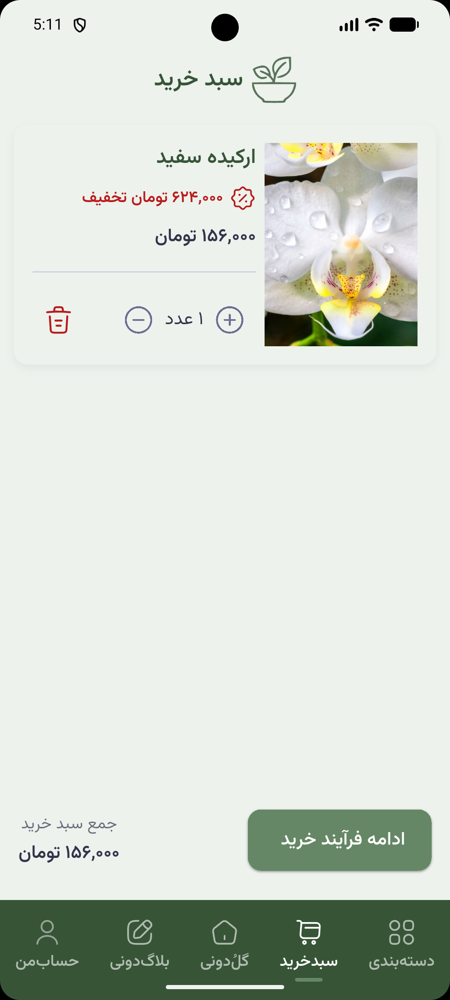
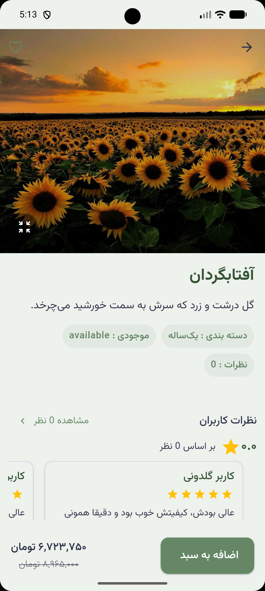
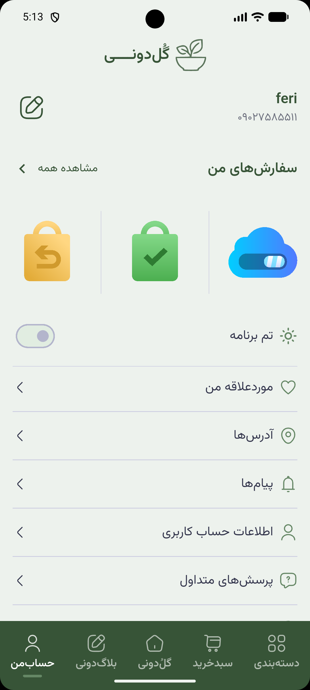

# گلدونی 🌿

اپلیکیشن فروشگاهی گلدونی — یک اپلیکیشن موبایل فروشگاه آنلاین گل و گیاه، ساخته شده با Flutter.

---

## اسکرین‌شات‌ها

> اسکرین‌شات‌های اپلیکیشن را اینجا قرار دهید:

| ثبتنام |
|  |  |  |
| صفحه اصلی | محصولات | سبد خرید |
|:---------:|:-------:|:--------:|
|  |  |  |

| صفحه جزئیات محصول | پروفایل |
|:------------------:|:-------:|:-----:|
|  |  |

---

## ویژگی‌ها

- صفحه اصلی با اسلایدر و محصولات ویژه
- مشاهده دسته‌بندی محصولات
- جستجوی محصولات
- مشاهده جزئیات محصول
- سبد خرید و مدیریت سفارشات
- ثبت‌نام و ورود با شماره موبایل (OTP)
- وبلاگ و مقالات مرتبط با گل و گیاه
- نقشه و موقعیت مکانی
- پشتیبانی از زبان فارسی و راست‌چین (RTL)

---

## فناوری‌ها و پکیج‌ها

| پکیج | کاربرد |
|-------|--------|
| `flutter_bloc` | مدیریت State |
| `get_it` | Dependency Injection |
| `dio` | درخواست‌های HTTP |
| `flutter_osm_plugin` | نقشه و موقعیت مکانی |
| `flutter_screenutil` | طراحی ریسپانسیو |
| `geolocator` | دریافت موقعیت مکانی کاربر |
| `shared_preferences` | ذخیره‌سازی محلی |
| `flutter_svg` | نمایش SVG |
| `carousel_slider` | اسلایدر صفحه اصلی |
| `shimmer` | انیمیشن بارگذاری |
| `animate_do` | انیمیشن‌های UI |
| `flutter_styled_toast` | نوتیفیکیشن Toast |
| `fpdart` | Functional Programming |
| `loading_animation_widget` | انیمیشن لودینگ |

---

## معماری پروژه

پروژه با الگوی **Clean Architecture** و **BLoC Pattern** پیاده‌سازی شده است:

```
lib/
├── core/                  # هسته اپلیکیشن
│   ├── errors/            # مدیریت خطاها
│   ├── resources/         # تم، رنگ‌ها و منابع مشترک
│   ├── usecase/           # کلاس‌های UseCase پایه
│   ├── utils/             # ابزارهای کمکی
│   └── widgets/           # ویجت‌های مشترک
├── feature/               # ماژول‌های اپلیکیشن
│   ├── auth/              # احراز هویت
│   ├── blog/              # وبلاگ
│   ├── blog_single/       # جزئیات مقاله
│   ├── cart/              # سبد خرید
│   ├── cats/              # دسته‌بندی‌ها
│   ├── home/              # صفحه اصلی
│   ├── profile/           # پروفایل کاربر
│   ├── singleproduct/     # جزئیات محصول
│   └── splash/            # صفحه اسپلش
├── di_container.dart      # تنظیمات Dependency Injection
├── export_pkg.dart        # اکسپورت پکیج‌ها
└── main.dart              # نقطه ورود اپلیکیشن
```

هر ماژول شامل سه لایه است:
- **data**: داده‌ها و API
- **domain**: منطق تجاری و مدل‌ها
- **presentation**: UI و BLoC

---

## نصب و اجرا

### پیش‌نیازها

- Flutter SDK `>= 3.11.0`
- Dart SDK `>= 3.11.0`
- Android Studio یا VS Code
- شبیه‌ساز یا دستگاه فیزیکی

### مراحل اجرا

```bash
# کلون کردن پروژه
git clone https://github.com/FarzinNs83/goldooni.git

# ورود به پوشه پروژه
cd goldooni

# نصب وابستگی‌ها
flutter pub get

# اجرای اپلیکیشن
flutter run
```

---

## ساختار فونت

از فونت **Vazirmatn** استفاده شده است با وزن‌های مختلف:

| وزن | فایل |
|-----|------|
| 300 | Light |
| 400 | Regular |
| 500 | Medium |
| 600 | SemiBold |
| 700 | Bold |

---

## مشارکت

contributions welcome! لطفاً issues و pull request ارسال کنید.

---

## مجوز

MIT License
